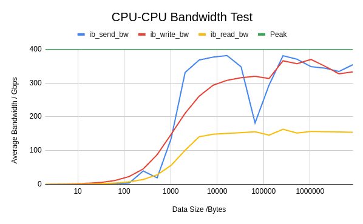

## Validating RoCE using CPU-CPU bandwidth testing 

Commands


```bash
ib_send_bw:	ib_send_bw	-d 	$NCCL_IB_HCA	-a	-t 2048	-r 2048 -l 128 --recv_post_list=128 -b -m 4096 -n 64000				
ib_write_bw	ib_write_bw	-d 	$NCCL_IB_HCA	-a	-l 128 --recv_post_list=128 -b -m 4096 -n 64000				
ib_read_bw:	ib_read_bw	-d 	$NCCL_IB_HCA	-a	-l 128 --recv_post_list=128 -b -m 4096 -n 64000								
```





| Data Size (B) | ib_send_bw (MB/s) | ib_write_bw (MB/s) | ib_read_bw (MB/s) | ib_send_bw (Gbps) | ib_write_bw (Gbps) | ib_read_bw (Gbps) | Peak (Gbps)|
|--------------|------------------|-------------------|------------------|------------------|-------------------|------------------|------|
| 2           | 10.09            | 45.91             | 14.66            | 0                | 0                 | 0                | 800  |
| 4           | 9.81             | 93.43             | 29.42            | 0                | 1                 | 0                | 800  |
| 8           | 76.9             | 183.44            | 59.01            | 1                | 1                 | 0                | 800  |
| 16          | 416.28           | 361.73            | 118.1            | 3                | 3                 | 1                | 800  |
| 32          | 59.66            | 719.4             | 235.8            | 0                | 6                 | 2                | 800  |
| 64          | 205.23           | 1457.53           | 471.48           | 2                | 11                | 4                | 800  |
| 128         | 465.44           | 2952.79           | 931.83           | 4                | 23                | 7                | 800  |
| 256         | 5057.65          | 5819.85           | 1822.89          | 40               | 45                | 14               | 800  |
| 512         | 2446.53          | 11230.79          | 3594.83          | 19               | 88                | 28               | 800  |
| 1024        | 17344.29         | 18963.66          | 7182.94          | 136              | 148               | 56               | 800  |
| 2048        | 42394.52         | 26920.56          | 12900.68         | 331              | 210               | 101              | 800  |
| 4096        | 47093.7          | 33385.39          | 18006.36         | 368              | 261               | 141              | 800  |
| 8192        | 48220.37         | 37548.51          | 18982.54         | 377              | 293               | 148              | 800  |
| 16384       | 48782.05         | 39411.62          | 19292.14         | 381              | 308               | 151              | 800  |
| 32768       | 44536.19         | 40402.88          | 19567.53         | 348              | 316               | 153              | 800  |
| 65536       | 23244.12         | 40930.65          | 19925.46         | 182              | 320               | 156              | 800  |
| 131072      | 37602.29         | 40089.59          | 18641.48         | 294              | 313               | 146              | 800  |
| 262144      | 48738.16         | 46807.86          | 20852.8          | 381              | 366               | 163              | 800  |
| 524288      | 47399.32         | 45707.64          | 19423.71         | 370              | 357               | 152              | 800  |
| 1048576     | 44581.71         | 47331.84          | 20028.38         | 348              | 370               | 156              | 800  |
| 2097152     | 44016.44         | 44735.71          | 19930.66         | 344              | 349               | 156              | 800  |
| 4194304     | 42763.83         | 41880.64          | 19861.87         | 334              | 327               | 155              | 800  |
| 8388608     | 45341.55         | 42605.82          | 19708.53         | 354              | 333               | 154              | 800  |


 Largest average bandwidth achieved w/o -b (bidirectional) flag 
| ib_send_bw (MB/s) | ib_write_bw (MB/s) | ib_read_bw (MB/s) | ib_send_bw (Gbps) | ib_write_bw (Gbps) | ib_read_bw (Gbps) | Peak (Gbps)|
|------------------|-------------------|------------------|------------------|-------------------|------------------|------|
| 26917.76         | 26902.00          | 10256.88         | 210              | 210               | 80               | 400  |


