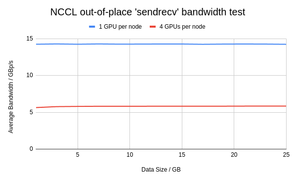

## GPU-GPU performance testing using NCCL tests

Command:
```bash
NCCL_ALGO=RING  mpirun -np 2 -host localhost,$ROCE_REMOTE_IP ./build/sendrecv_perf -b 1024M -e 26656M -i 2048M 2 -g <> -a 1
```

Largest possible bandwidth value: 400 Gbps
Largest observed average bandwidth value for 1 GPU per node: 15.49 GB/s = 123.92 Gbps
Largest observed average bandwidth value for 4 GPUs per node: 5.84 GB/s = 46.72 Gbps

Initial observation: Increasing the number of GPUs per node ends up reducing the network performance. 

